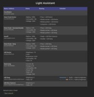
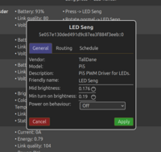
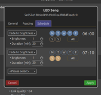
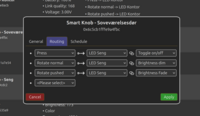
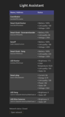

# Light Assistant

Light Assistant is a lightweight home automation tool focused on easy and intuitive control of lights. The name is a pun on both its simplicity in usage and its main purpose.

The project is provided as-is; it is a project I wrote for my own use at home, but if it can help you out as well, I am glad 😊

## My motivation

This project was started out from my own need for a "home automation" system but not finding the available solutions viable for my needs – for various reasons. In brief, my needs (and thus reasons for starting this project) were these:

 - It should be simple to set up and use. I found Home Assistant too complicated, and it still could not quite do what I wanted it to (without resorting ugly yaml, or C# code with hard-coded device names).
 - It should be able to dim the lights *very* slowly. Off-the-shelf product can do this (with Zigbee lights) in the "bright" spectrum of light intensities. However, at low light conditions they fail (due to 8 bit limitations in Zigbee).
 - Most lights (all the lights I have encountered) have a gamma curve response to light intensities. That is; at low values, there is a lot of light intensity change with each increment, while at high values, the intensity change is very small. I wanted some software that would correct for this gamma curve.

There you have it. On the other hand, I have not any need (yet) for the ocean of different devices out there, nor any user / password management. So I skipped that.

## Screenshots

A few screenshots just to give you an impression of the frontend side:

<table>
  <tr>
    <td><a target="_blank" href="images/main_screen_desktop.png"> Main panel (desktop)</a></td>
    <td><a target="_blank" href="images/led_general.png"> LED – General tab</a></td>
    <td><a target="_blank" href="images/led_schedule.png"> LED – Schedule tab</a></td>
    <td><a target="_blank" href="images/smart_knob_routing.png"> Smart Knob routing</a></td>
    <td><a target="_blank" href="images/main_screen_mobile.png"> Main panel (mobile)</a></td>
  </tr>
</table>

## Launch debug session

This is a quick start for getting a feeling for the project:
 - Open the project with VS Code, opening it with the Dev Container option.
 - Start the offline emulation of the backend server: Press `F5` to start debugging it.
 - Download npm dependencies: Press `ctrl-shift-b` (to launch task) and choose `Install npm dependencies`.
 - Start the webgui frontend: Press `ctrl-shift-b` and choose `Run web server`.
 - Point your web browser at https://localhost:5173

## Warning

There is currently no user/password protection implemented. Only run this on *trusted* home networks!

## Build for deployment

In order to set this system up, you need the following services running:

 * A message broker (MQTT). I use [Mosquitto](https://mosquitto.org/).
 * The [Zigbee2Mqtt](https://www.zigbee2mqtt.io/) service.
 * The [Light Assistant C# backend](src/).
 * A webserver (I use [Lighttpd](https://www.lighttpd.net/)) hosting the [Light Assistant WebGui frontend](webgui/).
 * Optional: The PiPwm service (for PWM-controlling LEDs with a GPIO).

To make this easier, I have prepared the following:

 * A [`Dockerfile`](Dockerfile) building the frontend and backend, and packaging it together in a Docker image with Lighttpd serving the webgui.
   * Build it with `docker build . -t light-assistant:latest` (in this directory).
 * A [`Dockerfile`](pipwm/Dockerfile) for [PiPwm](./pipwm/README.md) that encapsulates what this service need.
   * Build it with `docker build . -t pipwm:latest` (in the [`pipwm`](./pipwm/) directory).
 * A set of [`systemd`](./systemd/README.md) files, using Docker to download and run the Mqtt-related services.

To build the main project and encapsulate into a docker image for deployment, run:

## Child Project: pipwm

[`pipwm`](./pipwm/README.md) is a PWM controller for Raspberry Pi, publishing PWM controller data on an MQTT bus.

## License

Licensed under the [BSD 3-Clause License](./LICENSE).
